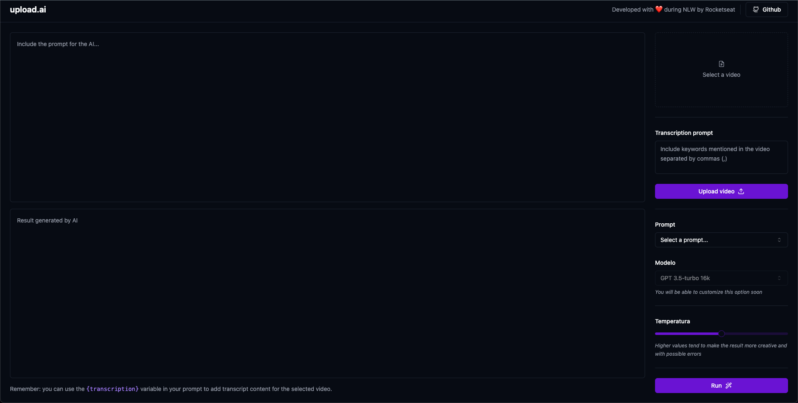

# NLW AI - React Project with AI Integration

This application is designed to transcribe and interpret video content using advanced AI. Users can upload a video, provide a contextual transcription prompt, and the system will convert the video to audio and transcribe it. With the generated transcription, users can then instruct the AI (currently using the GPT-3.5 model) to perform tasks, such as generating video titles. This serves as a tool for content creators and analysts to easily convert, transcribe, and derive insights or content suggestions from their videos.



## Technologies Used

- **React**: JavaScript library for building user interfaces.
- **Vite**: A build tool that enhances the frontend development experience.
- **Tailwind CSS**: A utility-first CSS framework for creating custom designs.
- **Radix UI**: Provides UI primitives to aid in crafting high-quality, accessible design systems.
- **ffmpeg**: Facilitates the conversion of MP4 videos to MP3 audio.
- **AI**: Collaborates with a backend harnessing AI, delivering advanced features and functionalities.

## Installation & Setup

1. **Clone the repository**

   ```bash
   git clone https://github.com/leandrodsi/nlw-ai.git
   ```

2. **Navigate into the directory**

   ```bash
   cd nlw-ai/upload-ai-web
   ```

3. **Install dependencies** <br />
   Using pnpm:

```bash
pnpm i
```

Using npm:

```bash
npm install
```

Using yarn:

```bash
yarn
```

4. **Start the development server** <br />
   Using pnpm:

```bash
pnpm run dev
```

Using npm:

```bash
npm run dev
```

Using yarn:

```bash
yarn dev
```
